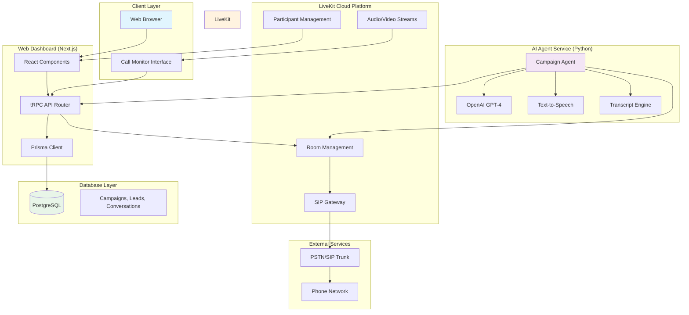
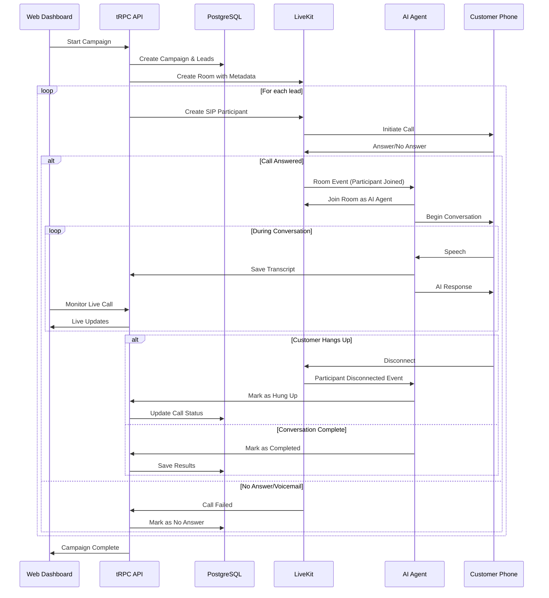
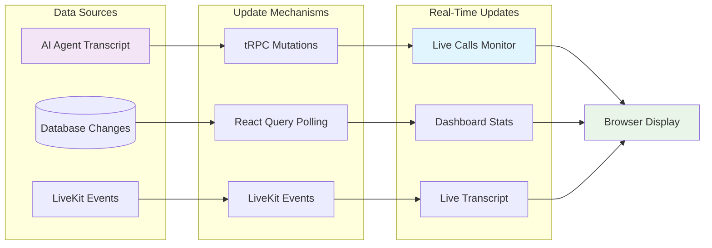
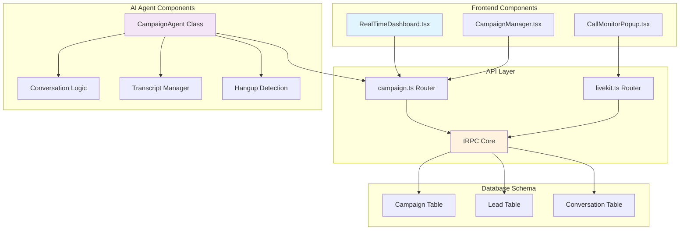
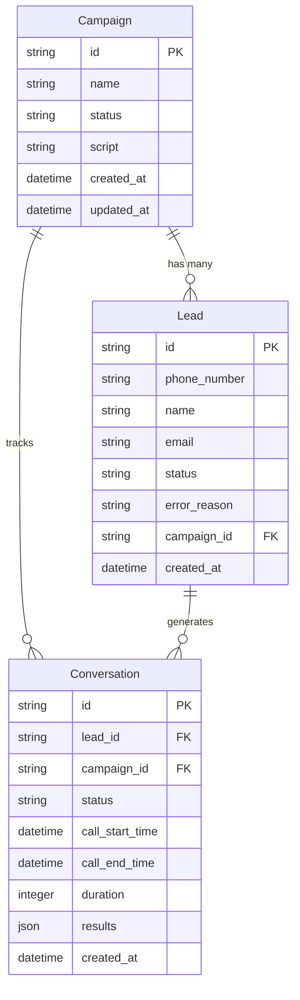
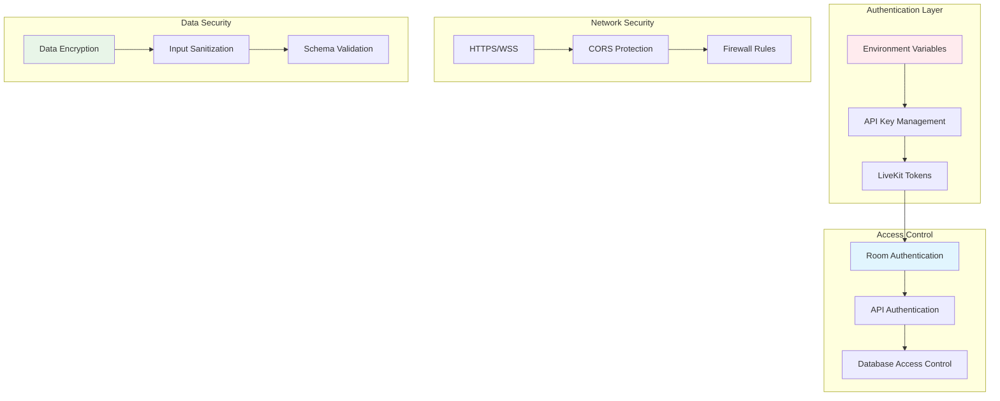
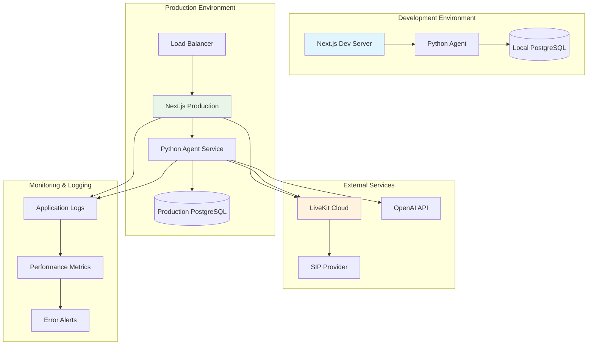
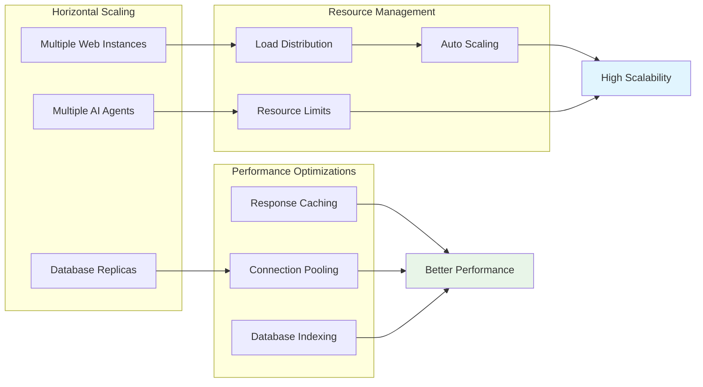
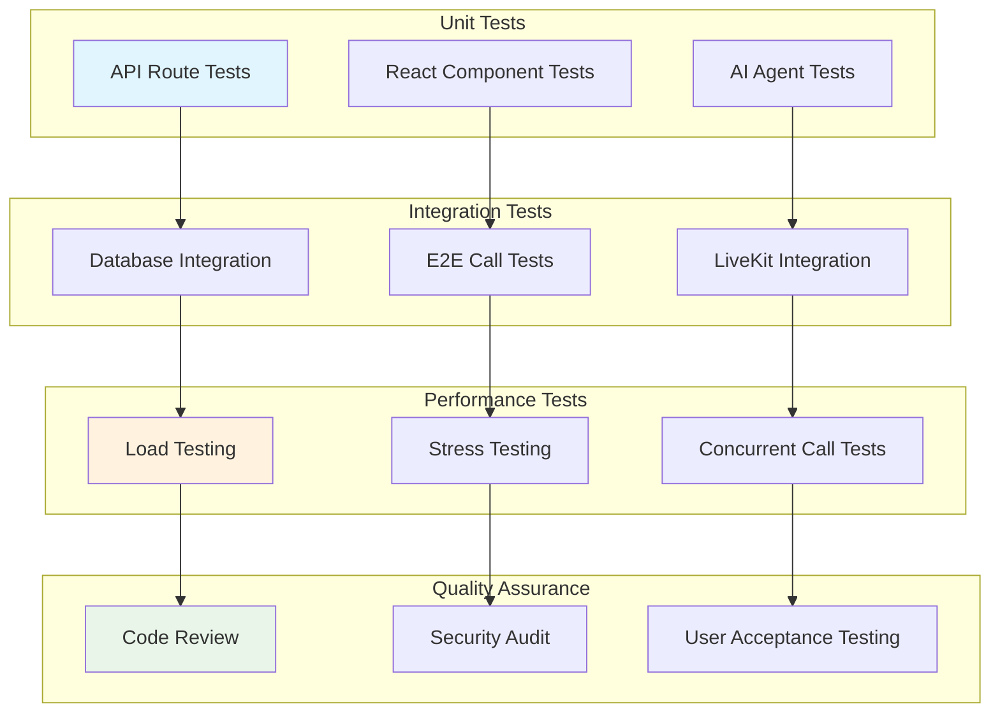
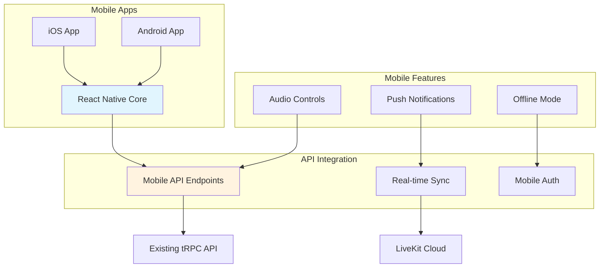

# System Architecture Diagrams

## 🏗️ High-Level System Architecture



## 📞 Call Flow Architecture



## 🔄 Real-Time Data Flow



## 🏢 Component Architecture



## 📊 Data Model Relationships



## 🔐 Security Architecture



## 🚀 Deployment Architecture



## 📈 Scalability Considerations



## 🔄 Development Workflow

```mermaid
gitgraph
    commit id: "Initial Setup"
    branch feature/dashboard
    commit id: "Create Dashboard"
    commit id: "Add Real-time Updates"
    checkout main
    merge feature/dashboard
    
    branch feature/ai-agent
    commit id: "Implement AI Agent"
    commit id: "Add Transcript Capture"
    checkout main
    merge feature/ai-agent
    
    branch feature/monitoring
    commit id: "Live Call Monitoring"
    commit id: "Hangup Detection"
    checkout main
    merge feature/monitoring
    
    commit id: "Production Deploy"
```

## 🧪 Testing Strategy



## 📱 Mobile Architecture (Future)



---

## 📋 Architecture Decision Records (ADRs)

### ADR-001: LiveKit for Real-time Communication
**Decision**: Use LiveKit for SIP integration and real-time communication
**Rationale**: 
- Mature WebRTC infrastructure
- Built-in SIP gateway support
- Excellent documentation and SDK support
- Scalable cloud infrastructure

### ADR-002: Next.js + tRPC for Frontend/API
**Decision**: Use Next.js with tRPC for type-safe full-stack development
**Rationale**:
- Type safety across client/server boundary
- Excellent developer experience
- Built-in optimizations and SSR
- Strong ecosystem and community

### ADR-003: Python for AI Agent
**Decision**: Use Python for AI agent implementation
**Rationale**:
- Rich AI/ML ecosystem
- LiveKit Agents SDK available
- OpenAI SDK support
- Easier conversation logic implementation

### ADR-004: PostgreSQL for Data Storage
**Decision**: Use PostgreSQL with JSON support for flexible data storage
**Rationale**:
- ACID compliance for critical data
- JSON support for flexible transcript storage
- Excellent Prisma ORM integration
- Proven scalability and reliability

---

**This architecture supports the current feature set while providing a foundation for future scalability and enhancements.** 